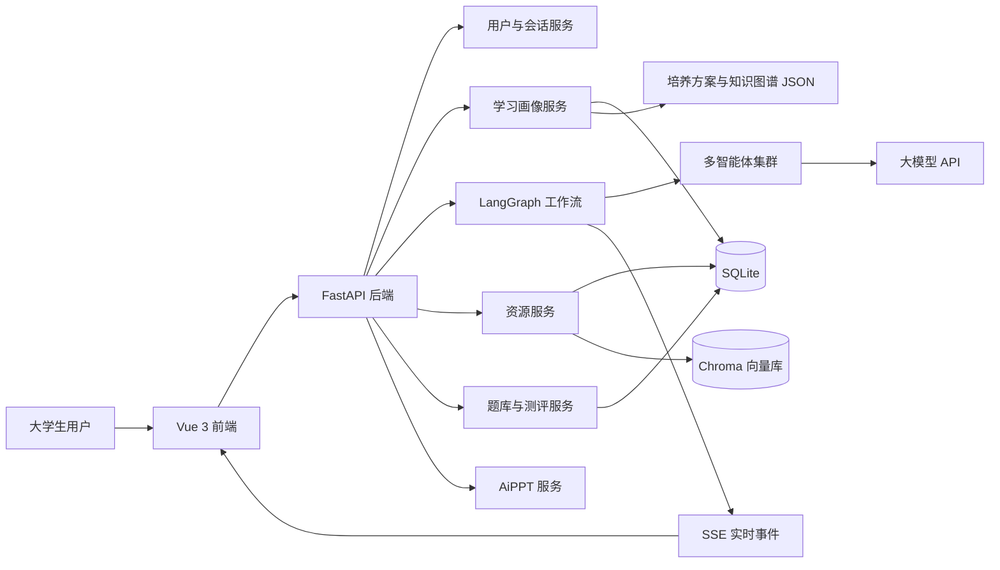
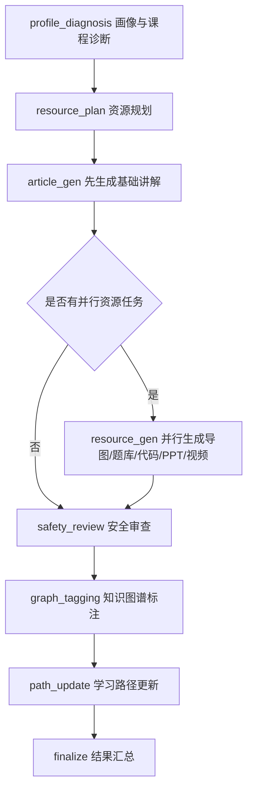
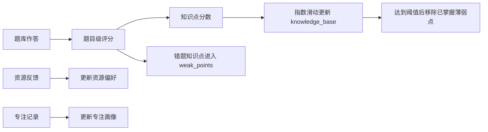

# 个性化学习智能体系统参赛最终文档

版本：V1.0  
日期：2026-07-12  
项目目录：`personalized-learning-agents`

## 1. 文档概述

### 1.1 编写目的

本文档面向软件系统类竞赛最终提交，按照系统开发说明书、需求规格说明书、测试说明书和部署说明书的组织方式，系统说明“个性化学习智能体系统”的需求来源、总体设计、智能体实现、测试验证、部署运行、创新实践与用户体验策略。

系统目标是为新时代大学生提供一个可持续更新的 AI 学习助手：先建立学生画像，再结合专业培养方案、课程知识图谱、答题结果、错题、资源反馈和专注记录，动态生成学习资源、学习路径、微测验、思维导图、代码案例、动画演示、视频推荐和 AiPPT 课件，形成“诊断-生成-学习-测评-反馈-再推荐”的闭环。

### 1.2 适用范围

本文档适用于：

- 参赛评审：了解系统价值、技术路线、开发流程、测试覆盖与创新点。
- 开发团队：统一后续功能迭代、测试验收、部署运维的依据。
- 演示团队：提炼答辩时的系统架构、业务闭环和案例数据。

### 1.3 参考资料

- UNESCO, `Guidance for generative AI in education and research`, 2023，强调教育场景中的人本、隐私、安全、公平和有意义使用。
- EDUCAUSE, `2024 Horizon Report: Teaching and Learning Edition`, 2024，将人工智能、学习分析、数字素养、学生支持列为高等教育教学变革的重要议题。
- `The Evolving Usage of GenAI by Computing Students`, arXiv, 2024，显示北美计算机学生中从未使用 ChatGPT 求助的比例由 2023 年的 34.1% 下降到 2024 年的 6.3%。
- `Educational data mining and learning analytics: An updated survey`, arXiv, 2024，总结教育数据挖掘与学习分析在预测、推荐、诊断和反馈中的长期发展。
- 中国高等教育公开统计资料：2024 年中国高等教育毛入学率约 60.8%，高等教育在学规模约 4,846 万人，说明高校个性化学习服务具有足够大的真实用户基础。

## 2. 项目背景与需求分析

### 2.1 时代背景

新时代大学生的学习环境呈现四个显著变化。

第一，学习内容复杂度上升。计算机、软件工程、人工智能、智能科学等专业课程之间依赖关系强，学生既需要掌握高等数学、离散数学、数据结构、操作系统等基础课程，也要快速进入大模型、知识图谱、计算机视觉、自然语言处理、工业软件、石油与人工智能等交叉方向。

第二，学习资源爆炸但组织不足。大学生可获得文章、视频、代码、课件、题库、在线课程等大量材料，但常见问题是“资源很多，不知道从哪里学起”“看懂了但不会做题”“错题反复出现但缺少知识点级追踪”。

第三，生成式 AI 已成为学习工具。公开研究表明，计算机学生把 GenAI 作为学习求助工具的比例快速上升。系统不能简单回避 AI，而应将 AI 纳入可解释、可审查、可追踪的学习流程，防止直接代写、幻觉和过度依赖。

第四，高校教育正在从“统一进度”走向“数据驱动的个性化支持”。学习分析、知识追踪、错题复盘、资源推荐和形成性评价逐渐成为智能教育系统的重要能力。

### 2.2 用户群体

| 用户类型 | 核心诉求 | 系统响应 |
| --- | --- | --- |
| 本科低年级学生 | 需要建立课程地图，补齐数学、程序设计、数据结构等基础 | 对话建档、课程图谱、入门资源、微测验诊断 |
| 本科高年级学生 | 需要面向项目、竞赛、考研或就业进行专项提升 | 多智能体资源包、代码案例、学习路径、AiPPT |
| 薄弱课程学生 | 需要知道自己具体薄弱在哪里，并获得针对性练习 | 错题知识点归因、SM-2 复习、专项题库 |
| 跨专业学习者 | 需要快速理解前置关系和学习顺序 | 培养方案图谱、课程先修关系、资源推荐 |
| 教师或助教 | 需要辅助生成讲解材料、题库和课件 | 内容生成、题库生成、PPT 分步生成与安全过滤 |

### 2.3 需求调研结论

结合赛题要求、公开研究和本项目实现，系统将大学生学习需求归纳为六类。

| 需求类别 | 典型问题 | 技术结合点 |
| --- | --- | --- |
| 学情画像 | 不知道自己的薄弱点和资源偏好 | 对话建档、微测验、历史对话、答题记录、资源反馈融合 |
| 课程路径 | 不知道课程先修关系和学习顺序 | 培养方案 JSON、课程关系图、知识点图谱、学习路径生成 |
| 个性化内容 | 需要适合自己水平的讲解、案例、题目 | LLM 内容生成、画像上下文、知识点绑定、安全审查 |
| 形成性评价 | 看完资源后缺少检测和复盘 | 题库生成、答题评分、知识点掌握度更新、错题统计 |
| 多模态资源 | 只看文字效率低，需要图、动画、PPT、视频 | 思维导图、HTML 动画、AiPPT、B 站视频推荐 |
| 学习闭环 | 学完后系统不记忆、不更新 | SQLite 持久化、Chroma 向量索引、事件流、画像历史 |

### 2.4 功能性需求

| 编号 | 需求名称 | 优先级 | 说明 |
| --- | --- | --- | --- |
| FR-01 | 用户登录与会话管理 | 高 | 支持用户身份、历史会话、消息保存和会话恢复 |
| FR-02 | 对话式学习画像建档 | 高 | 通过课程选择、微测验、访谈问题、知识图谱标注建立画像 |
| FR-03 | 课程与知识图谱展示 | 高 | 展示专业培养方案、课程节点、先修关系、知识点掌握度 |
| FR-04 | 多智能体学习工作流 | 高 | 自动完成画像分析、学情诊断、资源规划、并行生成、安全审查、知识标注、路径更新 |
| FR-05 | 学习资源生成 | 高 | 生成文章、题库、代码案例、思维导图、动画、PPT、视频推荐 |
| FR-06 | 资源管理与反馈 | 中 | 支持资源列表、标签、收藏、学习进度、反馈和向量索引 |
| FR-07 | 题库作答与掌握度更新 | 高 | 按知识点统计正确率，更新知识库、薄弱点和画像证据 |
| FR-08 | 错题与薄弱点复习 | 高 | 支持错题记录、知识点归因、复习推荐 |
| FR-09 | AiPPT 分步课件生成 | 中 | 绑定课程和知识点后进入 AiPPT 工作台，保存 PPTX 和预览信息 |
| FR-10 | 实时执行可视化 | 中 | 通过 SSE 展示智能体阶段、工具调用、资源生成结果 |

### 2.5 非功能性需求

| 类别 | 要求 |
| --- | --- |
| 可用性 | 前端支持对话模式和任务模式，避免把普通问答与资源生成混在一起 |
| 可解释性 | 每次画像更新保留来源证据，资源绑定课程与知识点，智能体执行阶段可视化 |
| 安全性 | 不在代码中硬编码密钥；生成内容经过关键词安全过滤；配置通过 API 配置或环境变量管理 |
| 可扩展性 | 智能体注册表、资源类型映射、LangGraph 子图均支持后续扩展 |
| 性能 | 资源向量检索按用户过滤，资源生成可并行执行，前端流式展示减少等待感 |
| 可维护性 | 前后端分层清晰，模型、路由、服务、智能体、图编排独立组织 |

## 3. 数据与案例支撑

### 3.1 外部数据依据

| 数据或结论 | 对系统设计的启发 |
| --- | --- |
| 中国高等教育在学规模约 4,846 万人，毛入学率约 60.8% | 个性化学习助手具有大规模真实应用场景，不是小众需求 |
| UNESCO 生成式 AI 教育指南强调隐私、安全、公平、人本和教育有效性 | 系统采用安全过滤、画像证据、知识点绑定和人机协同，而不是让 AI 直接替代学习 |
| EDUCAUSE 2024 Horizon 报告将 AI、学习分析、数字素养、学生支持列为关键趋势 | 系统把 LLM、学习分析、知识图谱、学生支持集成在同一学习闭环 |
| 2024 年计算机学生 GenAI 使用研究显示 ChatGPT 已接近在线搜索成为常用求助方式 | 系统将 AI 求助转化为可追踪的学习资源、练习和掌握度更新，降低“只问不练”的风险 |

### 3.2 项目内数据资产

仓库内已沉淀面向计算机与人工智能类专业的课程和知识点数据：

| 数据资产 | 当前规模 | 用途 |
| --- | --- | --- |
| 专业培养方案文件 | 4 个：计算机科学、软件工程、人工智能、智能科学 | 专业课程图谱、课程推荐、学期定位 |
| 培养方案课程节点 | 约 202 个课程条目 | 课程路径规划、先修关系展示 |
| 培养方案关系边 | 约 113 条课程关系 | 先修、支撑、进阶、交叉领域关系推理 |
| 知识点图谱文件 | 76 个课程知识点文件 | 课程内知识点绑定和资源标签 |
| 知识点节点 | 约 562 个节点 | 题目归因、资源标注、掌握度统计 |
| 知识点关系 | 约 607 条边 | 知识结构可视化、学习顺序推荐 |
| 诊断题库 | 约 32 个课程分组、26 个题目块 | 初始画像和弱点诊断 |

说明：部分历史 JSON 文件存在中文编码损坏或格式不完整问题，文档中的课程和知识点规模以正则统计的仓库资产规模为依据；运行时严格解析的模块需要继续进行编码治理和数据校验。

### 3.3 典型使用案例

案例：人工智能专业学生希望学习“数据结构中的树与二叉树”。

1. 学生进入画像页，系统根据专业、年级和课程选择加载可诊断课程。
2. 学生完成微测验，系统将错题归因到“树与二叉树”等知识点，并更新 `knowledge_base` 和 `weak_points`。
3. 学生在任务模式输入“帮我系统学习树与二叉树并生成练习和思维导图”。
4. LangGraph 工作流先读取学生画像，再识别课程和知识点，生成资源计划。
5. 内容智能体生成讲解文章和题库，导图智能体生成结构图，代码智能体生成 Python 案例，视频智能体检索相关教学视频，课件智能体创建 AiPPT 会话。
6. 系统将资源绑定到课程与知识点，写入数据库和向量库，并生成学习路径步骤。
7. 学生完成题库后，系统依据题目级正确率更新掌握度；如果掌握度超过阈值，薄弱点可被移除。

该案例体现了赛题要求中的“需求与技术结合点”：AI 不是孤立生成答案，而是围绕大学课程知识图谱和学生画像形成持续反馈。

## 4. 系统总体设计

### 4.1 总体架构



### 4.2 技术栈

| 层次 | 技术 | 作用 |
| --- | --- | --- |
| 前端 | Vue 3、TypeScript、Vite、Pinia、Vue Router、Element Plus | 单页应用、状态管理、路由与 UI 组件 |
| 可视化 | ECharts、Markmap、KaTeX、Markdown-it | 课程图谱、思维导图、公式和 Markdown 渲染 |
| 后端 | FastAPI、Pydantic、SQLAlchemy、Uvicorn | REST API、流式接口、数据访问 |
| 智能体 | 自研 BaseAgent、AgentState、Agent 注册表 | 统一智能体处理协议 |
| 编排 | LangGraph | 学习工作流、多阶段图执行、并行资源生成 |
| 数据库 | SQLite | 用户、画像、资源、题库、错题、路径、PPT 会话持久化 |
| 向量检索 | Chroma、SentenceTransformer | 学习资源索引与 RAG 检索 |
| 大模型 | OpenAI SDK 兼容接口、PPT 专用配置 | 对话、内容生成、题库、课件大纲等 |
| 实时通信 | Server-Sent Events | 智能体执行过程、token 和阶段事件推送 |

### 4.3 目录结构说明

```text
personalized-learning-agents/
├─ backend/
│  ├─ agents/              # 智能体定义、注册表、工具与技能
│  ├─ api/routes/          # FastAPI 路由
│  ├─ core/                # 数据库、鉴权、LLM 客户端、SSE、向量库
│  ├─ data/                # 培养方案、诊断题库、课程数据
│  ├─ graph/               # LangGraph 状态、节点、子图
│  ├─ models/              # SQLAlchemy 数据模型
│  ├─ services/            # 画像、资源、课程、PPT、RAG、推荐等服务
│  └─ static/              # PPT、预览、知识点图谱等静态资源
├─ frontend/
│  ├─ src/api/             # 前端 API 封装
│  ├─ src/components/      # 画像、资源、智能体时间线等组件
│  ├─ src/stores/          # Pinia 状态
│  ├─ src/views/           # 页面视图
│  └─ src/utils/           # Markdown、标签等工具
└─ docs/
   └─ final-project-documentation.md
```

### 4.4 核心数据模型

| 模型 | 主要字段 | 说明 |
| --- | --- | --- |
| `StudentProfile` | 专业、年级、知识掌握、薄弱点、学习目标、资源偏好、画像证据 | 学生画像核心表 |
| `LearningResource` | 类型、标题、内容、标签、课程、知识点、进度、收藏 | 学习资源表 |
| `QuizRecord` | 题目、答案、得分、知识点 | 作答记录 |
| `MistakeQuestion` | 错题、分析、错误次数、最近错误时间 | 错题归因 |
| `CoursePath` | 课程、步骤、进度、资源关联 | 学习路径 |
| `WeakPoint` | 薄弱点、掌握分、复习间隔、下次复习时间 | 间隔复习 |
| `PptSession` | AiPPT 会话、token、状态、资源 ID | 课件生成闭环 |
| `ProfileHistory` | 触发来源、画像快照、增量 | 画像可追溯记录 |

## 5. 智能体设计与 AI 融合方案

### 5.1 智能体体系

系统以 `BaseAgent` 为统一抽象，每个智能体接收 `AgentState`，输出新的状态和响应。

| 智能体 | 文件 | 责任 |
| --- | --- | --- |
| 画像智能体 | `profile_agent.py` | 读取和更新学生画像 |
| 内容生成智能体 | `content_gen_agent.py` | 生成文章、题库、代码案例、动画、PPT 会话 |
| 思维导图智能体 | `mindmap_agent.py` | 将学习主题组织为结构化导图 |
| 测评智能体 | `evaluation_agent.py` | 生成或汇总学习评价 |
| 对话智能体 | `chat_agent.py` | 普通概念解释、学习建议、对话问答 |
| 视频智能体 | `video_agent.py` | 检索并推荐教学视频 |
| 编排智能体 | `orchestrator_agent.py` | 调用 LangGraph 多智能体资源生成流程 |

### 5.2 工作流编排



该流程的关键设计点：

- 先诊断再生成：资源生成前读取画像、课程和知识点，避免泛化输出。
- 先文章后导图：导图可参考讲解文章，减少结构漂移。
- 并行生成资源：题库、代码、视频、PPT 等资源可并行，降低等待时间。
- 安全审查后入库：生成内容经过安全过滤，再进入资源库和向量库。
- 课程图谱绑定：资源会携带 `course_name`、`knowledge_points`、`kp_weights` 和置信度。
- 路径更新有边界：只有课程级、多知识点学习才生成课程学习路径，避免把碎片知识误判为完整课程。

### 5.3 大模型融合方法

系统没有把大模型简单包装成聊天框，而是通过四层约束提高教育场景可靠性。

| 约束层 | 实现方式 | 价值 |
| --- | --- | --- |
| 画像约束 | Prompt 中注入专业、年级、知识基础、学习目标和资源偏好 | 输出难度与学习者匹配 |
| 知识点约束 | 题目、资源、PPT 必须绑定课程和知识点 | 便于后续评价和路径更新 |
| 格式约束 | 题库必须返回 JSON，题型限制为单选、填空、编程 | 前端可交互作答，后端可评分 |
| 安全约束 | 敏感关键词过滤、幻觉规约、可疑内容替换 | 降低不当内容和伪造来源风险 |

### 5.4 RAG 与向量检索

资源生成后，系统会将资源内容切分为约 1500 字符的 chunk，并使用 SentenceTransformer 生成向量，写入 Chroma 集合 `learning_resources`。检索时按 `user_id` 过滤，避免不同用户资源混淆。

该机制支持：

- 学生回访历史资源时，系统可以按语义找到相关材料。
- 智能体可基于已生成资源继续补充讲解、题目或导图。
- 用户长期使用后形成个人学习资料库。

### 5.5 画像更新与掌握度规则

系统采用证据驱动的画像更新策略。



掌握度只由题目正确率自动更新；资源完成、路径进度和智能重建只作为证据记录，不直接修改知识点分数。这一策略避免“看完资源就算掌握”的虚假学习进度。

## 6. 详细功能设计

### 6.1 前端页面

| 页面 | 路由 | 功能 |
| --- | --- | --- |
| 首页 | `/` | 系统入口 |
| 智能体面板 | `/agent` | 对话/任务双模式、文件上传、智能体时间线、资源跳转 |
| 学习画像 | `/profile` | 对话建档、画像摘要、知识图谱、正确率分析、智能重建 |
| 学习资源 | `/resources` | 资源列表、资源详情、资源包、进度与反馈 |
| 错题本 | `/mistakes` | 错题管理、薄弱点复盘 |
| 学习路径 | `/path`、`/learning-path` | 课程路径和步骤管理 |
| AiPPT | `/ppt` | PPT 会话启动、生成状态、资源保存 |
| 配置 | `/config` | LLM 与 PPT 模型配置 |
| 登录 | `/auth` | 用户登录入口 |

### 6.2 对话模式与任务模式

智能体面板将用户输入分为两类：

- 对话模式：适合概念解释、公式推导、学习建议。
- 任务模式：适合生成资源、PPT、视频、思维导图、题库、学习路径等需要工具和持久化的任务。

前端通过意图规则识别“生成 PPT”“推荐视频”“出题”“学习路径”等需求，并提示用户切换到任务模式。这一设计减少误操作，也让评审可以清楚看到系统不是单一聊天机器人。

### 6.3 对话式画像建档

画像建档流程包括：

1. 根据用户专业加载培养方案和可诊断课程。
2. 选择最多 3 门诊断课程。
3. 生成或读取缓存微测验。
4. 提交作答结果，更新课程掌握度和薄弱知识点。
5. 回答 6 个访谈问题，提取学习目标、认知风格、资源偏好和常见困难。
6. 在知识图谱上标注熟悉、陌生、重点节点。
7. 保存画像，并写入 `ProfileHistory`。

### 6.4 多模态学习资源

| 资源类型 | 生成方式 | 教学作用 |
| --- | --- | --- |
| 文章 | LLM Markdown 讲解 | 建立概念和例题理解 |
| 题库 | LLM JSON 输出，后端规范化 | 检测掌握度，驱动画像更新 |
| 代码案例 | LLM 生成可运行代码 | 支持编程和算法实践 |
| 动画 | 单文件 HTML/CSS/JS | 可视化动态过程 |
| 思维导图 | 导图智能体结构化输出 | 梳理知识层次 |
| PPT | Docmee AiPPT 或 PPT 模型 | 课程汇报与复习课件 |
| 视频 | 视频智能体检索推荐 | 补充外部教学资源 |

### 6.5 课程知识图谱

课程知识图谱分两层：

- 专业培养方案层：课程、学期、学分、类别、模块、先修/支撑/进阶关系。
- 课程知识点层：每门课程内的知识点节点、关系边和类别。

系统通过课程图谱解决“学什么”和“先学什么”，通过知识点图谱解决“薄弱在哪里”和“资源绑定到哪里”。

### 6.6 错题与间隔复习

错题记录会保留错误题目、解析、错误次数和最近错误时间。薄弱点服务采用类似 SM-2 的间隔复习思想：

- 答对时延长复习间隔并提高 ease factor。
- 答错时将复习间隔重置为 1 天。
- 掌握度达到阈值且作答次数足够时进入 mastered 状态。

该机制把一次性做题转化为长期复习计划，适合大学课程中高遗忘率、高迁移要求的知识点。

### 6.7 AiPPT 分步生成

PPT 不直接由一次 LLM 输出完成，而是创建 `PptSession`，进入 AiPPT 工作台：

1. 解析主题和课程知识点绑定。
2. 创建 Docmee API token 和本地会话。
3. 用户在嵌入式工作台确认大纲与模板。
4. 生成完成后下载 PPTX 到 `backend/static/ppt`。
5. 创建 `LearningResource`，绑定课程和知识点。
6. 触发预览生成和资源创建事件。

这种方式比直接输出 Markdown 幻灯片更接近真实课件生产流程。

## 7. 系统开发说明书

### 7.1 开发环境

| 项目 | 说明 |
| --- | --- |
| 操作系统 | Windows / Linux 均可 |
| 后端语言 | Python 3.13 环境下已有缓存文件；建议 Python 3.11+ |
| 前端语言 | TypeScript |
| 后端启动 | `uvicorn main:app --reload`，工作目录为 `backend` |
| 前端启动 | `npm run dev`，工作目录为 `frontend` |
| 数据库 | SQLite，默认 `backend/learning.db` |
| 大模型配置 | 通过后端配置服务或环境变量提供，不应写入代码仓库 |

### 7.2 后端开发流程

后端以 FastAPI 为入口，在 `main.py` 中完成：

1. 创建数据库表。
2. 对历史数据库执行轻量列迁移。
3. 注册异常处理器。
4. 挂载静态目录 `/static`。
5. 注册画像、内容、导图、测评、对话、视频等智能体。
6. 初始化技能系统。
7. 注册 API 路由。
8. 提供 `/health` 健康检查。

### 7.3 前端开发流程

前端以 Vue 3 单页应用实现：

1. `router.ts` 定义页面路由和登录守卫。
2. `api/` 封装后端接口。
3. `stores/` 维护用户、主题、智能体任务、事件等状态。
4. `views/` 组织页面。
5. `components/` 复用画像建档、课程图谱、资源预览、智能体时间线等组件。
6. SSE 流用于实时渲染智能体执行过程。

### 7.4 数据库设计原则

- 用户行为与学习证据分离：画像表保存当前状态，画像历史表保存来源和增量。
- 资源内容与索引分离：结构化资源存 SQLite，语义检索索引存 Chroma。
- 学习进度与掌握度分离：资源进度只表示行为，知识掌握度只由作答结果更新。
- PPT 会话与最终资源分离：`PptSession` 管理生成过程，完成后写入 `LearningResource`。

### 7.5 接口设计概览

| 路由文件 | 主要能力 |
| --- | --- |
| `auth.py` | 认证和用户 |
| `chat.py` | 普通对话 |
| `workflow.py` | 学习、复习、评价、视频流式工作流 |
| `agent_panel.py` | 任务模式、文件上传、智能体执行流 |
| `profile_onboarding.py` | 对话式画像建档 |
| `resource.py` | 资源生成、查询、反馈、进度 |
| `quiz.py` | 题库提交、统计 |
| `mistake.py` | 错题管理 |
| `course_path.py` | 学习路径生成与步骤更新 |
| `curriculum.py` | 培养方案和知识图谱 |
| `ppt.py` | AiPPT 会话、状态和保存 |
| `events.py` | 事件流 |
| `config.py` | 模型配置 |

## 8. 测试说明书

### 8.1 测试目标

测试目标覆盖：

- 后端服务能正常启动，数据库表能创建。
- 智能体注册和图编排能正常加载。
- 学习画像建档能完成诊断、访谈和图谱标注。
- 资源生成能返回结构化结果并入库。
- 题库作答能正确更新知识点掌握度和薄弱点。
- SSE 能稳定推送阶段事件。
- 前端能完成主要页面路由和构建。

### 8.2 测试环境

| 类型 | 配置 |
| --- | --- |
| 后端 | Python、FastAPI、SQLite、Chroma |
| 前端 | Node.js、npm、Vite |
| 模型 | 需要配置主 LLM API；PPT 功能需要额外配置 Docmee AiPPT 或 PPT 模型 |
| 数据 | `backend/data/curricula`、`backend/static/kp`、`backend/data/diagnostic_quizzes` |

### 8.3 测试用例

| 编号 | 测试项 | 前置条件 | 操作 | 期望结果 |
| --- | --- | --- | --- | --- |
| TC-01 | 健康检查 | 后端启动 | 请求 `/health` | 返回 `{"status":"ok"}` |
| TC-02 | 用户登录守卫 | 前端启动，未登录 | 访问 `/profile` | 跳转 `/auth` |
| TC-03 | 智能体注册 | 后端启动 | 查看启动日志 | 输出已注册智能体名称 |
| TC-04 | 学习工作流 | 已配置 LLM | 调用 `/api/workflow/study/stream` | 依次收到画像、诊断、资源、审查、路径事件 |
| TC-05 | 题库规范化 | 已配置 LLM | 生成混合题型题库 | 返回题目含 `single_choice`、`fill_blank` 或 `coding` |
| TC-06 | 掌握度更新 | 有题库资源 | 提交答案 | `knowledge_base` 更新，错题进入薄弱点 |
| TC-07 | 资源向量索引 | 生成文章资源 | 搜索相关主题 | 返回当前用户相关资源 |
| TC-08 | AiPPT 会话 | 配置 Docmee API | 创建 PPT 任务 | 返回 session、token 和嵌入配置 |
| TC-09 | 安全过滤 | 输入敏感内容 | 调用学习工作流 | 返回拒绝或过滤提示 |
| TC-10 | 前端构建 | 安装依赖 | 执行 `npm run build` | TypeScript 与 Vite 构建通过 |

### 8.4 已有测试脚本

仓库包含 `backend/test_graph.py`，用于验证 LangGraph 编译、路由函数、意图分类和流式更新等能力。脚本中部分预期节点来自旧版本图结构，当前 `graph/builder.py` 已简化为 chat 节点，而资源编排主要位于 `graph/subgraphs/resource_orchestration.py`；因此后续需要同步更新该测试脚本，避免测试预期与当前实现不一致。

建议后续新增：

- `test_resource_orchestration.py`：验证 `profile_diagnosis -> resource_plan -> finalize` 主链路。
- `test_content_gen_normalize.py`：验证题库 JSON 清洗、题型限制和知识点权重。
- `test_profile_update.py`：验证作答结果对画像、薄弱点和历史记录的影响。
- `test_curriculum_data.py`：验证培养方案和知识点图谱 JSON 可解析、节点数非空、关系边合法。

### 8.5 缺陷与风险记录

| 风险 | 影响 | 应对 |
| --- | --- | --- |
| 部分历史数据文件中文编码损坏 | JSON 解析失败、图谱节点不可读 | 统一 UTF-8 编码，增加数据校验脚本 |
| LLM 输出不稳定 | 题库或资源结构不符合预期 | 后端规范化、重试、严格 JSON schema |
| API 密钥配置缺失 | 生成、PPT、视频等功能不可用 | 配置页提示，使用环境变量或本地配置 |
| 生成内容幻觉 | 错误知识或伪造来源 | Prompt 规约、安全审查、知识点绑定、人工复核入口 |
| 前端长流任务等待 | 用户误以为卡死 | SSE 阶段事件、智能体时间线、资源增量展示 |

## 9. 部署说明书

### 9.1 本地部署

后端：

```powershell
cd backend
python -m venv .venv
.\.venv\Scripts\Activate.ps1
pip install -r requirements.txt
uvicorn main:app --host 0.0.0.0 --port 8000 --reload
```

前端：

```powershell
cd frontend
npm install
npm run dev
```

访问地址通常为：

- 前端：`http://localhost:5173`
- 后端：`http://localhost:8000`
- 健康检查：`http://localhost:8000/health`

### 9.2 配置项

| 配置 | 说明 |
| --- | --- |
| 主 LLM API Key | 对话、内容生成、题库、导图等 |
| 主 LLM Base URL | OpenAI 兼容接口地址 |
| PPT API Key | Docmee AiPPT 或其他课件模型 |
| `RAG_MODEL_NAME` | 向量模型，默认 `all-MiniLM-L6-v2` |
| `RAG_CHUNK_SIZE` | 资源切分长度，默认 1500 |
| `ENABLE_LLM_SAFETY` | 是否启用 LLM 安全审查 |

配置原则：密钥不得写入代码、文档或日志；应通过环境变量、本地配置文件或配置页面输入，并在提交仓库前确认 `.gitignore` 覆盖私密配置。

### 9.3 生产部署建议

- 使用 Nginx 反向代理前后端，启用 HTTPS。
- 后端使用 `uvicorn` 或 `gunicorn + uvicorn workers` 常驻运行。
- SQLite 可满足演示和小规模试用，正式部署建议迁移到 PostgreSQL。
- Chroma 数据目录应单独挂载持久化卷。
- 静态 PPT 与预览文件应放在对象存储或持久化目录。
- 对 SSE 接口关闭代理缓冲，保证实时事件能及时到达前端。
- 为 LLM 调用设置超时、重试和限流，避免高并发下阻塞。

## 10. 创新实践

### 10.1 从“聊天机器人”升级为“学习闭环系统”

系统不是只回答问题，而是将问题转化为画像、课程、知识点、资源、练习、路径和复盘。每一次学习行为都可以成为下一次推荐的证据。

### 10.2 多智能体可视化协作

系统把画像、规划、生成、审查、知识标注、路径更新等阶段拆分为智能体事件，并在前端以时间线展示。用户可以看到 AI 正在做什么，降低黑箱感。

### 10.3 课程图谱与生成式 AI 融合

生成式 AI 负责内容生产，课程知识图谱负责边界和结构。资源不是孤立文本，而是绑定到具体课程和知识点，便于后续测评和推荐。

### 10.4 证据驱动画像

画像中的学习目标、认知风格、资源偏好、知识掌握度、薄弱点都有来源记录。尤其是掌握度只由作答结果更新，避免“AI 说你会了”。

### 10.5 多模态资源包

同一学习主题可以生成文章、导图、题库、代码案例、动画、PPT、视频，适配不同认知风格和学习任务。

### 10.6 AiPPT 分步生产

课件生成采用会话式工作台，支持用户确认大纲和模板后再生成 PPTX，符合真实教学材料生产流程。

## 11. 用户体验提升策略

| 策略 | 实现 |
| --- | --- |
| 降低首次使用门槛 | 无画像时引导“开始对话建档” |
| 明确模式边界 | 对话模式负责解释，任务模式负责工具执行和资源落库 |
| 实时反馈 | SSE 推送智能体事件、token、阶段和资源结果 |
| 可视化认知 | 课程图谱、知识点图谱、思维导图、学习路径、正确率分析 |
| 可恢复学习 | 会话历史、资源库、学习路径、画像历史均持久化 |
| 结果可行动 | 每个路径步骤有资源、预计时长、检查点和完成状态 |
| 风险提示 | PPT 未配置、LLM 未配置、生成失败等情况返回明确错误 |

## 12. 安全与合规设计

1. 密钥管理：`api_config.example.json` 仅提供模板，真实密钥不应提交；运行时通过本地配置或环境变量读取。
2. 内容安全：输入和输出均有敏感关键词检查，输出不安全时替换为系统提示。
3. 幻觉控制：生成 Prompt 明确要求不确定内容标注“不确定/需进一步查证”，不得编造教材、论文、链接或学生画像。
4. 数据隔离：RAG 检索按 `user_id` 过滤。
5. 可追溯：画像更新写入 `ProfileHistory`，资源绑定课程和知识点，PPT 会话保留状态。
6. 人机协同：AiPPT、学习路径、资源反馈均保留用户确认和修正空间。

## 13. 项目现状与后续计划

### 13.1 当前完成度

| 模块 | 状态 |
| --- | --- |
| Vue 前端页面 | 已实现主要页面 |
| FastAPI 后端 | 已实现主要路由 |
| 多智能体注册 | 已实现 |
| LangGraph 资源编排 | 已实现资源子图 |
| 学习画像 | 已实现对话建档和历史 |
| 课程图谱 | 已实现培养方案与知识点图谱加载 |
| 资源生成 | 已实现文章、题库、代码、动画、PPT、视频等 |
| RAG | 已实现资源索引和检索 |
| 测评与错题 | 已实现作答、统计、薄弱点 |
| AiPPT | 已实现会话和保存流程 |

### 13.2 后续优化

1. 数据治理：修复历史 JSON 中文编码，增加 CI 数据校验。
2. 测试补强：同步更新 `test_graph.py`，新增服务层和工作流测试。
3. 评价增强：引入更细粒度的题目难度、区分度和知识点权重。
4. 推荐增强：结合资源反馈、学习时段和错题间隔做排序。
5. 教师端：增加课程包审核、题库审核和班级学习分析。
6. 部署升级：生产环境迁移 PostgreSQL、对象存储和集中日志。

## 14. 总结

个性化学习智能体系统围绕新时代大学生的真实学习痛点，将生成式 AI、多智能体编排、课程知识图谱、学习画像、形成性评价和多模态资源生成整合为完整学习闭环。系统既能满足“快速获得解释和资源”的即时需求，也能通过题库作答、错题复盘、路径推进和画像历史支持长期学习改进。

从竞赛要求看，本项目在需求层面深入覆盖大学生的目标、薄弱点、资源偏好、课程路径和 AI 使用风险；在技术开发层面完整呈现了智能体设计、开发、测试、部署和优化流程；在创新层面体现了课程图谱约束生成、证据驱动画像、多智能体协作可视化和 AiPPT 分步生成等实践。

## 附录 A：核心启动命令

```powershell
# 后端
cd backend
uvicorn main:app --reload

# 前端
cd frontend
npm run dev

# 前端生产构建
cd frontend
npm run build
```

## 附录 B：参考链接

- UNESCO Guidance for generative AI in education and research: https://www.unesco.org/en/articles/guidance-generative-ai-education-and-research
- EDUCAUSE 2024 Horizon Report Teaching and Learning Edition: https://library.educause.edu/resources/2024/5/2024-educause-horizon-report-teaching-and-learning-edition
- The Evolving Usage of GenAI by Computing Students: https://arxiv.org/abs/2412.16453
- Educational data mining and learning analytics: An updated survey: https://arxiv.org/abs/2402.07956
- Higher education in China: https://en.wikipedia.org/wiki/Higher_education_in_China
