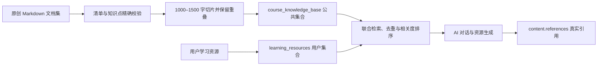

# 数据结构完整初始知识库说明

## 1. 建设目的

本项目以高校计算机类专业核心课程《数据结构》作为首门完整课程样例，构造团队原创的初始知识库/文档集，为 AI 对话、文章生成、题库生成、代码案例与可视化动画生成提供稳定的事实依据。

课程知识库与用户学习资源分层存储：公共课程资料可供所有用户检索；用户资源继续按 `user_id` 隔离，不能被其他用户检索。知识库只提供学习内容依据，不改变掌握度规则，掌握度仍只由题目提交正确率更新。

## 2. 目录结构

课程清单位于 `backend/data/knowledge_base/data_structures/manifest.json`，正文位于同目录的 Markdown 文件：

| 文件 | 内容 | 文档类型 |
| --- | --- | --- |
| `00_课程导论.md` | 课程框架、抽象数据类型、复杂度分析 | 章节 |
| `01_线性表.md` | 顺序表、链表与工程选择 | 章节 |
| `02_栈与队列.md` | 栈、队列、循环队列及应用 | 章节 |
| `03_树与二叉树.md` | 树、二叉树、遍历与哈夫曼编码 | 章节 |
| `04_图.md` | 图存储、遍历、最短路与最小生成树 | 章节 |
| `05_查找算法.md` | 顺序、二分、树表查找 | 章节 |
| `06_排序算法.md` | 常见排序、稳定性与复杂度 | 章节 |
| `07_哈希表.md` | 哈希函数、冲突处理与扩容 | 章节 |
| `08_综合实践.md` | 校园导航和学习任务管理项目 | 实践项目 |
| `09_综合练习与解析.md` | 综合题、诊断方法与答案解析 | 练习解析 |

每篇文档包含学习目标、核心概念、算法过程、复杂度分析、代码案例、例题、练习和参考答案。结构化变式练习由项目内确定性模板扩展，完整渲染语料不少于 5 万字，初始化时不依赖大模型生成。

## 3. 知识图谱绑定

所有文档的 `knowledge_points` 必须精确匹配 `backend/static/kp/数据结构.json` 中的节点 ID。当前覆盖节点如下：

- 线性表
- 栈与队列
- 树与二叉树
- 图
- 查找算法
- 排序算法
- 哈希表

初始化服务会先做严格校验。文件缺失、标签为空、出现近似标签或语料总量不足时，索引命令直接失败，不写入不可信向量数据。

## 4. RAG 数据流



公共文档元数据包含：

- `scope: system`
- `course_name: 数据结构`
- `document_id`、标题、章节、文档类型
- 精确知识点列表
- `source: team_constructed`
- 版本、内容哈希和索引时间

用户资源元数据使用 `scope: user` 和 `user_id`。联合检索只查询当前用户的私有集合切片，不会混入其他用户资源。

## 5. 初始化与状态检查

在后端目录执行：

```bash
python -m scripts.seed_course_knowledge_base
```

命令使用稳定文档 ID、切片 ID 和内容哈希。连续执行不会重复增长；文档内容或版本变化时会更新对应切片，并清理清单中已经删除的旧文档。

应用启动时会在后台检查版本和内容哈希。索引已就绪时直接跳过，未初始化或内容变化时自动补齐，不阻塞 FastAPI 启动。

状态接口：

```text
GET /api/curriculum/courseware/数据结构/status
```

返回课程版本、原始文档数、切片数、字数、最后索引时间和 `ready` 状态。

## 6. Linux 部署配置

建议在 systemd 服务中增加启动前幂等索引步骤：

```ini
[Service]
WorkingDirectory=/opt/personalized-learning-agents/backend
ExecStartPre=/opt/personalized-learning-agents/backend/.venv/bin/python -m scripts.seed_course_knowledge_base
ExecStart=/opt/personalized-learning-agents/backend/.venv/bin/uvicorn main:app --host 127.0.0.1 --port 8000
```

修改后执行：

```bash
sudo systemctl daemon-reload
sudo systemctl restart personalized-learning
sudo journalctl -u personalized-learning -n 100 --no-pager
```

## 7. 原创与引用声明

本目录课程正文、案例、练习、答案和结构化变式模板均由项目团队围绕课程知识图谱编写，不复制受版权保护教材章节。内容适用于本项目教学与比赛展示。AI 回答和生成资源只记录实际检索到的文档引用；检索未命中时会标记“未命中预制课程知识库”，不得伪造来源。

## 8. 验证证据

自动化测试覆盖：

- 文档数量、渲染字数和知识点精确匹配；
- 连续初始化的幂等性；
- 内容哈希一致时跳过重复索引；
- 公共资料与当前用户资料联合检索；
- 其他用户私有资料不能进入结果。

执行命令：

```bash
python -m unittest tests.test_course_knowledge_base -v
```
